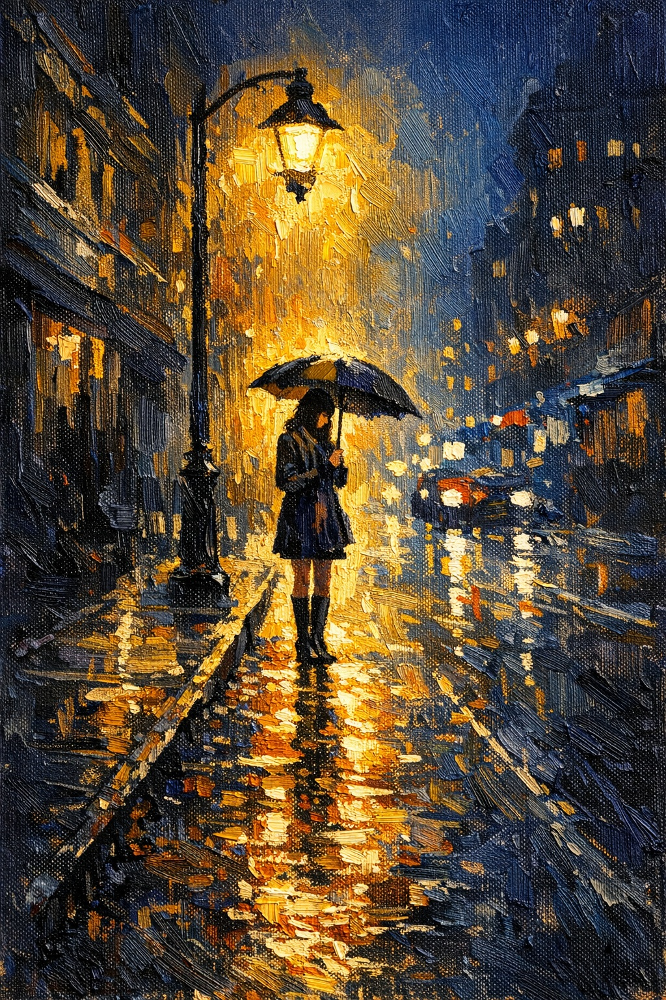
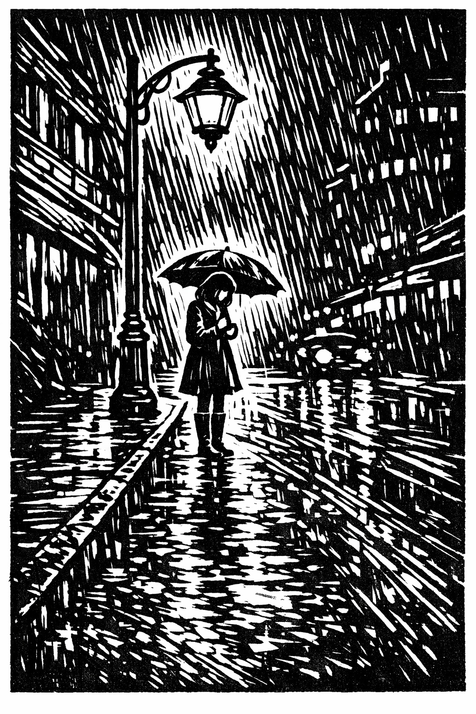
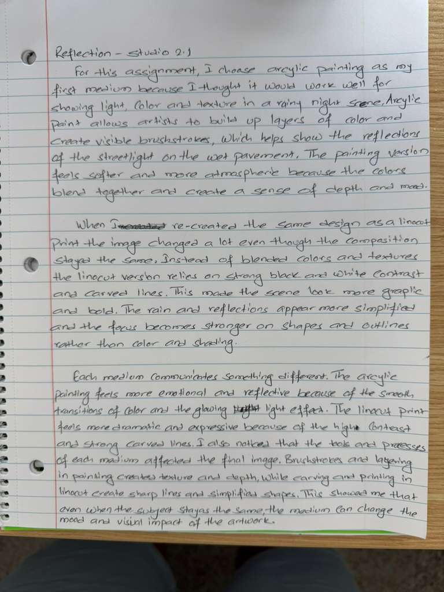

# Visual Prompt Studio 2.1 – Exploring Medium Through Prompt Variation

## Prompt A – Acrylic Painting

Create an acrylic painting that emphasizes contrast, texture, movement, and emphasis. Show a young woman standing alone in a rainy city street at night holding an umbrella under a glowing streetlight. Use visible brushstrokes, layered acrylic paint, and thick texture to create the wet surface of the street and the glowing light reflections. The composition should use directional lines from the sidewalk and buildings to guide the viewer’s eye toward the woman. Use contrast between the warm yellow light and the cool dark blue night to create mood and focus. The painting should feel emotional, quiet, and reflective.

---

## Prompt B – Linocut Print

Create a linocut print that emphasizes contrast, texture, rhythm, and emphasis. Show a young woman standing alone in a rainy city street at night holding an umbrella under a streetlight. Use bold carved lines, strong black and white shapes, and repeated marks to suggest rain, reflections, and the city background. The composition should use directional lines from the street and buildings to lead the viewer’s eye toward the woman. Use the high contrast of black ink and white paper to make the figure the focal point. The print should feel dramatic, quiet, and expressive.

---

## Reflection

