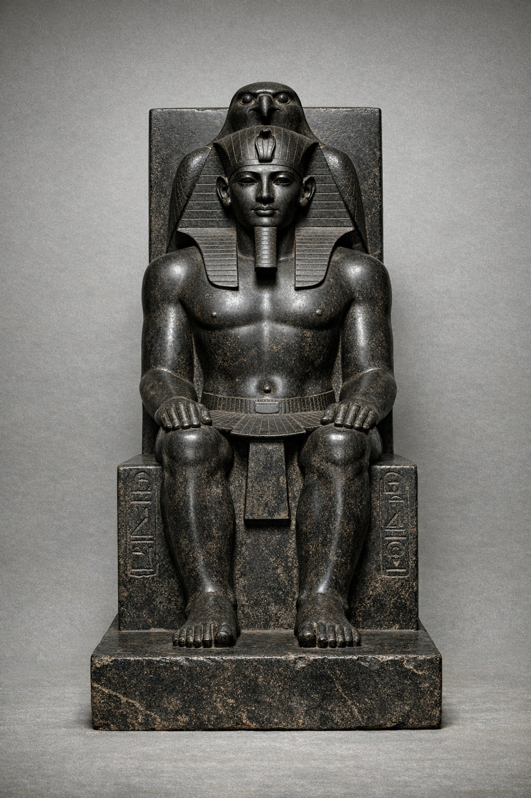
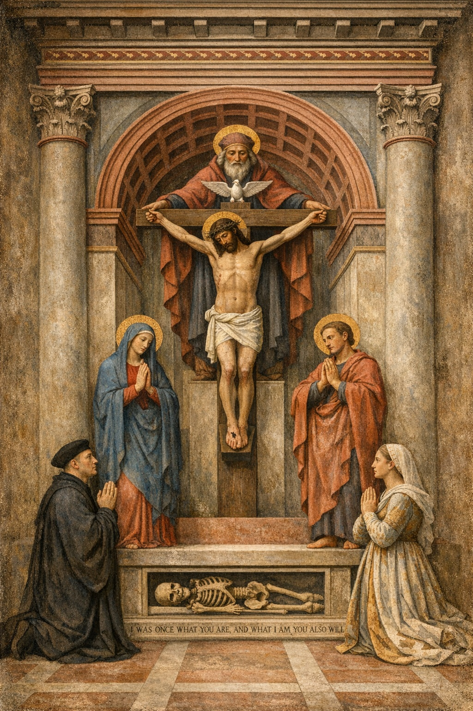

# Visual Prompt Studio 3.1 – Historical Context

## Prompt A – Art as Divine Power
Historical Theme: Art as divine power  
Historical Period: Ancient Egypt  
Artwork Inspiration: Khafre with the Falcon God Horus  
Medium: Stone sculpture  

See full prompt in prompt_A.md

---

## Prompt B – Humanism and the Move Toward Science
Historical Theme: Humanism and the move toward science  
Historical Period: Early Renaissance  
Artwork Inspiration: Masaccio, Trinity  
Medium: Fresco painting  

See full prompt in prompt_B.md
